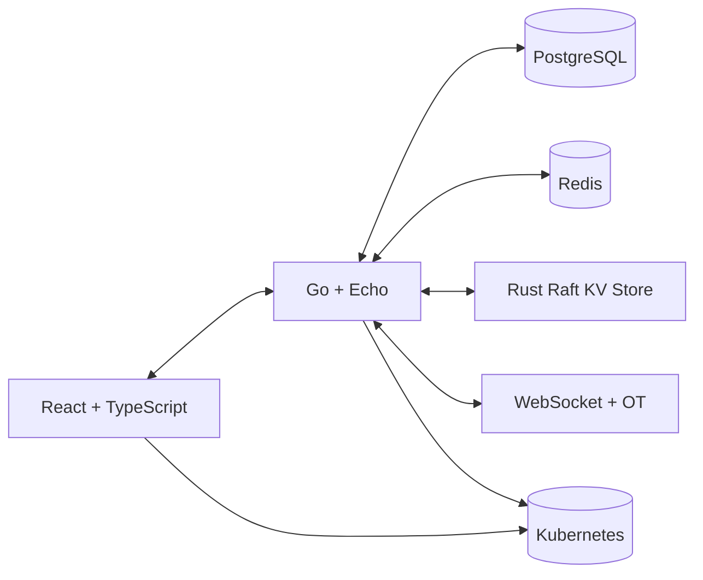

# SpecSync 📎

*Collaborative OpenAPI Design, Done Right*

SpecSync is a real-time, multi-user platform for designing and documenting APIs using OpenAPI (Swagger) specifications. Think of it as **Figma meets SwaggerHub** — empowering frontend, backend, and product teams to co-author API contracts with precision, speed, and clarity.

---

## 🚀 Features

* ✍️ **Live collaboration** – Real-time, multi-user editing with presence indicators and OT-based sync
* 🧠 **Schema-aware editor** – OpenAPI 3.0+ validation as you type (YAML & JSON)
* 💬 **Inline commenting** – Discuss individual fields, resolve feedback, and notify collaborators
* 🕘 **Version history & diffs** – Review API evolution, compare versions, and roll back easily
* 🔐 **Role-based permissions** – Owner, Editor, Viewer access at project and team level
* 🌐 **OAuth2 login** – Secure authentication via Google
* 🧭 **Rust-based Raft KV integration** – Strongly consistent session metadata across clustered nodes
* 🐳 **Cloud-native deployment** – Docker, Kubernetes, and GitHub Actions for CI/CD

---

## 🌟 Why SpecSync?

Traditional API workflows involve local editing, Git-based PRs, and fragmented feedback tools.
SpecSync brings API design into the modern era:

* Real-time collaboration, like Google Docs
* Validation and structure, like Swagger
* Feedback workflows, like Figma
* Deployable anywhere — OSS-first

---

## 🧱 Architecture



---

## 🧰 Tech Stack

| Layer         | Tech Stack                                 |
| ------------- | ------------------------------------------ |
| Frontend      | React, TypeScript, CodeMirror, TailwindCSS |
| Backend       | Go, Echo, JWT, WebSockets, OAuth2          |
| Database      | PostgreSQL, Redis                          |
| Realtime Sync | WebSockets, Operational Transforms         |
| Infra         | Docker, Kubernetes, GitHub Actions         |
| Raft Store    | Rust, Raft consensus, gRPC/REST API        |

---

## 📆 Getting Started

### Prerequisites

* Go (v1.21+)
* Node.js (v18+)
* Docker + Docker Compose
* Postgres & Redis (locally or via Docker)

### Backend

```bash
cd backend
cp .env.example .env
make run-dev
```

### Frontend

```bash
cd frontend
npm install
npm run dev
```

### Raft KV Store

```bash
cd raft-kv/
cargo run
```

---

## 📊 Roadmap

* [x] Backend scaffolding (OAuth, teams, projects, specs)
* [x] Raft KV client + session metadata coordination
* [ ] Real-time editor with OT + live cursor sync
* [ ] Versioning + diff viewer
* [ ] Role-based permissions
* [ ] Comments, notifications, Slack integration
* [ ] Hosted SaaS launch (with free tier)

---

## 🚀 Contributing

Pull requests are welcome! Please open an issue to discuss major changes first.

---

## ⚖️ License

[Apache 2.0](LICENSE)

---

## 📍 Acknowledgements

* OpenAPI Spec
* Raft consensus algorithm
* Figma, SwaggerHub, and CRDT/OT pioneers
